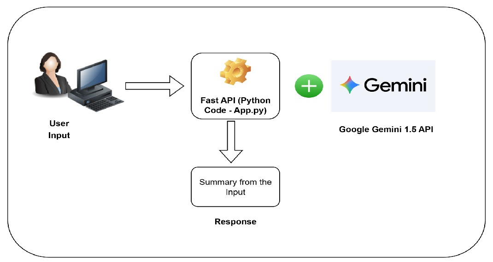

# 🌐 Text Summarization App with FastAPI & Google Gemini 1.5 🚀

This application provides a REST API endpoint to summarize plain-text content using Google's Gemini 1.5 LLM, powered by FastAPI in Python.

---

## Features

- 📝 Accepts text string input via API
- 🤖 Performs summarization using Google Gemini 1.5 API
- 🚀 Built with FastAPI for speed and automatic docs

---

## Requirements

List of required Python packages (see `requirements.txt`):

- fastapi
- uvicorn
- requests

Install with:

pip install -r requirements.txt

---

## Usage

1. **Start the API server**

uvicorn app:app --reload

2. **Send a POST request**

Endpoint: `/generate-summary`

Example JSON payload:

{
"prompt": "Your original text here.",
"max_tokens": 100
}

3. **Receive summarized response**

{
"summary": "Short summary generated from Gemini LLM."
}

4. **Swagger/OpenAPI docs:**  
Automatic docs at [http://localhost:8000/docs](http://localhost:8000/docs)

Demo: 

---

## File Structure

- `app.py` — FastAPI app for handling requests and interacting with Gemini LLM API
- `requirements.txt` — Minimal dependencies for running the server
- `TextSummaryArchitectureDiagram.jpg` — High-level architecture diagram

---

## Environment Setup

- Ensure environment variable/API key for Google Gemini is set up in `app.py`
- Python 3.8+ recommended

---

## License

MIT

---

## Acknowledgments

- [FastAPI](https://fastapi.tiangolo.com/) 🌐
- [Google Gemini 1.5 API](https://ai.google.dev/) 🤖
